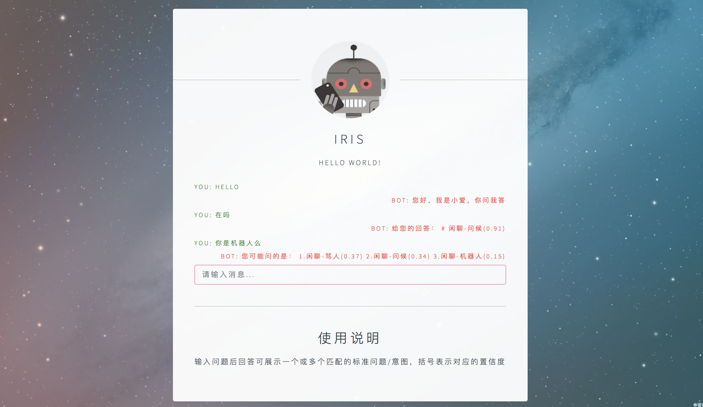

## faq(DBQA)框架(Author: fanzfeng)
## 快速体验
1. 安装python3依赖包: 参见requirements.txt
1. 模型训练: python3 classify/match_classify.py
1. 本地安装redis，启动redis-server
1. 通过脚本启动
   - cd demo
   - sh go_app.sh
1. http://localhost:8000

## 几个解决方案
### 方案逻辑1：检索+排序

#### query预处理
1. 词替换/纠错
  - 基于字典的字符串替换：定制近义词替换，少量词
  - 基于错词表的文本纠错(AC自动机)：使用场景如电话实时ASR转译结果，错词表较大
  - 基于笔画的词纠错 | todo：文本客服中用户手写字
  - 基于拼音的词纠错 | todo：文本客服中用户拼音打字 | 语音客服中用户的语言习惯，如前后鼻音等
  - 口语文本的特殊处理（详见论文http://www.cnki.com.cn/Article/CJFDTotal-MESS200301000.htm）
     - 口语冗余成分去除：如"我的意思是你明天要坐火车去北京么"中的"我的意思是"
     - 口语用词重复（存在多种重复类型，此工程中进行处理两种 {AB AB} 和{A AB}）
  - 特殊用词（实体）的掩码处理，如地点名词全部以特殊字符替代
2. 可以选择关键词检索或者语义检索
   - 关键词检索：倒排索引粗检索，召回topk
   - 语义检索：基于高维向量的检索
   - 文本向量转换器：基于词向量
3. 根据topk的结果计算相似性指标
   - levenshtein距离
   - tfidf
   - 基于词向量表示的wmd(中文词向量)
   - 语义匹配网络输出语义相似程度得分（各种文本匹配算法）
4. 需要特殊说明的是:
   - 文本特征+机器学习逻辑方式暂不考虑加入
5. 方案优缺点分析：
   - 优点：计算速度快，可处理大数据量需求，对于新增问题或者问法可以快速适应（更新索引即可）
   - 缺点：排序的监督算法不易构造数据（因为与最终系统表现的评估方法有差异）
   - 缺点：对于小数据量场景模型效果可能不理想（主要原因是排序模型）

### 方案逻辑2：文本分类
1. 文本分类算法
  - bert
  - textcnn
1. 方案优缺点分析：
  - 优点：模型效果可快速满足生产需求（一般效果基本上是高频问题的判准带起来的，数据不均衡问题可通过手动补充数据部分解决）
  - 缺点：
     - 当类别标签/问题数量非常大时，高维矩阵计算需要更多的时间，且新增问题需要重新训练模型，无法快速调整
     - 只能给出问题的标准问/意图的排序,但是一个意图下可能包括多个子问题, 无法展示出来
     
### 评价指标
1. 典型搜索/推荐场景: 排序<score, label>
  - ngcg/MAP
2. 两种方案对比<pred_label, label>
  - qa_precision@k, 前k个predlabel是否包含label, 包含为1, 否则为0, 计算平均值

### API应用逻辑
  - 结构：规则层»算法层»兜底
  - 规则层处理问候、感谢、骂人、切人工等常见回复或操作
  - 算法层展示逻辑
     - top1得分（或者1th-2th得分差值）超过阈值则展示一个
     - 限制条件取topk
  - 无可靠结果需要考虑切换人工服务
    
### 相关依赖：Bert服务
1. 参照(https://github.com/hanxiao/bert-as-service.git)
2. 现存问题：计算量有上限，测试的时候发现请求文本数据超过2w条是一直拿不到结果（机器：双Tesla M40 24GB）

### demo
1. from https://github.com/Conchylicultor/DeepQA
2. 修改之处
  - html图片素材（image）、输入框文字
  - 历史对话记录上屏方向、对齐方式、颜色（js、css）
  - 添加对话数据存储mysql | todo
  - 为日志添加时间信息
3. 依赖
- redis服务，本地OR远程(设置文件：demo/chatbot_sebsite/settings.py)
- django==1.10, channels==1.1.6, asgi-redis(https://github.com/Conchylicultor/DeepQA/issues/187)
4. 效果


### 代码结构

```angular2html
├── qa_api_v1.py                  检索-排序方案API（旧版本，需要更新）
├── qa_api_v2.py                   文本分类方案API（旧版本，需要更新）
├── data
│   ├── service
│   ├── doc
├── demo                        demo前后端（django）
│   ├── chatbot_interface        前端组件+后端脚本(chatbotmanager.py)
│   ├── chatbot_website          django后端组件
│   ├── db.sqlite3               数据库文件
│   ├── logs
│   └── manage.py                启动脚本
├── conf                        基础配置模块
│   ├── faq_config.py            基本参数配置         
├── manage_jup                  离线管理脚本
│   ├── faq_IndexManage.ipynb    索引离线管理
│   ├── faq_api_test.ipynb       server测试  
│   └── faq_evaluate.ipynb       效果评测
│   └── new_words_mine.ipynb     新词发现
├── classify                    分类方案
│   ├── match_classify.py        文本分类/意图分类（替代检索-排序逻辑）
├── matching 
│   ├── match_sim.py                语义网络匹配（旧版本）
│   ├── match_new.py                语义网络匹配(最新)
├── nets                        文本网络层
│   ├── network_sim.py           可用语义网络结构（算法）      
│   └── utils_net.py             网络基础工具类
├── models                      模型存放位置
├── text_process.py             可插拔的文本预处理模块
├── nlp_utils                   文本处理层
│   ├── asr_correct.py           文本纠错
│   └── hanzi                   集合的汉字处理（纠错|todo）模块，包括拼音、笔画、部首           
├── retrieval                   文本检索层
│   ├── qa_search.py             基于倒排索引的字典检索
│   ├── sem_search.py            基于annoy的向量检索
├── text2vector                 文本2向量转换器
│   └── ngrams.py                基于ngrams词典（包括分词）
│   └── tfidf.py                 基于tfidf的向量表示
│   └── vector_model.py          基于词向量/bert的向量表示

```
